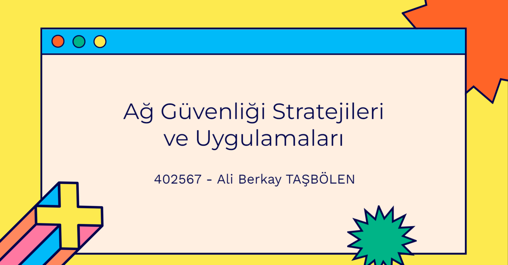

# Ağ Güvenliği Stratejileri ve Uygulamaları 
## Ali Berkay TAŞBÖLEN
### 402567 

**Güvenlik ve İnternet**

*İnternetin ilk ortaya çıkışı, güvenlik önlemleri düşünülerek tasarlanmamıştı. İnternetin temelleri, bilgi paylaşımını kolaylaştırmak ve bilimsel çalışmaları desteklemek amacıyla atıldı. Ancak zaman içinde, internetin popülerleşmesi ve yaygın olarak kullanılmasıyla birlikte güvenlik sorunları ortaya çıkmaya başladı.
İnternet güvenliği, bilgisayar korsanlığı, zararlı yazılımlar, veri sızıntıları gibi tehditlerle başa çıkmak amacıyla gelişti. Güvenlik önlemleri, kullanıcıların ve organizasyonların bilgilerini korumak, ağ trafiğini güvence altına almak ve siber saldırılara karşı dirençli bir altyapı oluşturmak için geliştirilmeye başlandı.
Günümüzde, internet güvenliği önemli bir endüstri haline gelmiş ve sürekli olarak evrim geçirmektedir. Siber güvenlik uzmanları, güvenlik yazılımları, ağ güvenliği protokolleri ve bilinçli kullanıcı eğitimi gibi bir dizi önlemi uygulayarak internet üzerindeki tehditlere karşı koruma sağlamaya çalışmaktadır.*
---

**----------AĞ GÜVENLİĞİ UYGULAMALARI VE ARAÇLARI----------**

**Güvenlik Duvarları, IDS/IPS, Antivirüs Yazılımları gibi Temel Güvenlik Uygulamalarının 
Önemi**

**1.Güvenlik Duvarları:**

•	Ağ trafiğini kontrol ederek istenmeyen erişimleri engeller.

•	Güvenli olmayan ağ trafiğini izole eder.

•	Giriş ve çıkış trafiği üzerinde denetim sağlar.

**2.IDS/IPS (Saldırı Algılama ve Önleme Sistemleri):**

•	Ağda anormal aktiviteleri izleyerek saldırıları tespit eder.

•	Tanımlanan saldırıları önleyerek sistemleri korur.

•	İmza tabanlı veya davranış tabanlı analizle saldırıları algılar.

**3.Antivirüs Yazılımları:**

•	Bilgisayar sistemlerini zararlı yazılımlardan korur.

•	Virüs, solucan, trojan gibi zararlı dosyaları tespit eder ve temizler.

•	Gerçek zamanlı veya periyodik taramalarla güvenlik sağlar.

**Peki Neden Güvenlik Uygulamalrını Kullanmaya İhtiyaç Duyarız?**

**1.Veri Güvenliği:**

•Bilgisayar korsanlarından, zararlı yazılımlardan ve saldırılardan kaynaklanan veri kaybını önler.

**2.Sistem Bütünlüğü:**

•Güvenlik uygulamaları, sistemlerin bütünlüğünü korur ve izinsiz değişikliklere karşı önlem alır.

**3.Hizmet Kesintilerini Önleme:**
•Saldırıları algılayarak ve engelleyerek, hizmet kesintilerini ve sistemlerin çalışmamasını önler.

**4.Kişisel Bilgi ve Gizlilik Koruma:**

•Kullanıcıların kişisel bilgilerini ve gizliliğini korur, kimlik hırsızlığına karşı önlemler alır.

**5.Kurumsal Güvenlik:**

•Şirket içindeki ağları ve sistemleri koruyarak, iş sürekliliğini ve ticari sırları güvence altına alır.

**6.Uygulama Güvenliği:**

•Zararlı yazılımların uygulamalara sızmasını engeller, böylece güvenli bir çalışma ortamı sağlar.

**7.Uygulama ve Sistem Performansını Artırma:**

•	Güvenlik önlemleri, zararlı aktivitelerin azaltılmasıyla sistem ve uygulama performansını artırabilir.

*Bu güvenlik uygulamaları, bilgisayar sistemlerini ve ağları çeşitli tehditlere karşı koruyarak, güvenilir, güvenli ve sürdürülebilir bir dijital ortam oluşturmayı amaçlar.*

**Verilerimizi neden şifreleme ihtiyacı duyarız?**

Verilerimizi şifreleme ihtiyacı, bilgilerimizin güvenliğini sağlamak ve yetkisiz erişimlere karşı koruma sağlamak amacıyla ortaya çıkar. Şifreleme, bilgisayar korsanları, kötü amaçlı yazılımlar, veri sızıntıları ve diğer siber tehditlere karşı bir güvenlik katmanı oluşturur. Şifrelenmiş veriler, yetkisiz kişilerin bu verilere erişmesini ve anlamasını zorlaştırarak, gizliliği korur. Ayrıca, şifreleme, veri bütünlüğünü sağlayarak verilerin değiştirilip değiştirilmediğini kontrol eder. Bu nedenle, günlük iletişimden finansal işlemlere kadar geniş bir yelpazede, verilerimizi şifreleyerek bilgi güvenliğini sağlama ihtiyacı doğar.

---
**Kriptografi ve Şifreleme Araçlarının Kullanımı ve Önemi**

**1.Gizlilik Sağlama:**

•Kriptografi, iletişim sırasında verilerin gizliliğini sağlar. Şifreleme, bilgilerin yetkisiz kişiler tarafından anlaşılamayacak şekilde korunmasını sağlar.

**2.Veri Bütünlüğünü Sağlama:**

•Şifreleme, veri bütünlüğünü korur. Verilerin iletim sırasında değiştirilip değiştirilmediğini kontrol eder ve korur.

**3.Kimlik Doğrulama:**

•Kriptografi, kimlik doğrulama süreçlerinde kullanılabilir. Güvenli iletişimde tarafların kimliklerini doğrulamak için şifreleme kullanılır.

**4.Güvenli İletişim:**

•İnternet üzerindeki iletişimi güvence altına almak için şifreleme önemlidir. SSL/TLS protokolleri gibi şifreleme yöntemleri, web sitelerinde güvenli bağlantıları sağlar.

**5.Veri Güvenliği ve Koruma:**

•Kriptografi, bilgisayar sistemlerinde ve depolama alanlarında veri güvenliğini artırır. Veriler şifrelenerek yetkisiz erişime karşı korunur.

**6.Siber Saldırılara Karşı Direnç:**

•Şifreleme, siber saldırılara karşı direnç oluşturur. Veri hırsızlığı, ransomware gibi saldırılara karşı etkili bir savunma mekanizması sunar.

**7.Yasal ve Uyumluluk Gereksinimlerini Karşılama:**

•Birçok sektörde, kişisel verilerin korunması yasaları ve uyumluluk gereksinimleri nedeniyle şifreleme kullanımı zorunlu hale gelmiştir.

**8.Güvenli Alışveriş ve Finans İşlemleri:**

•E-ticaret sitelerinde ve finansal işlemlerde şifreleme, müşteri bilgilerini ve finansal verileri koruyarak güvenli alışveriş ortamları oluşturur.

*Kriptografi ve şifreleme araçları, modern bilgi güvenliği stratejilerinin temelini oluşturarak siber tehditlere karşı etkili bir koruma sağlar.*

---

**----------GÜNCEL AĞ GÜVENLİĞİ SORUNLARI ve ÇÖZÜMLERİ----------**

 DDoS Saldırıları, Veri İhlalleri ve Diğer Güvenlik Tehditleriyle İlgili Güncel Sorunlar 
 
*Güncel siber güvenlik tehditleri şunları içerebilir:*

**1.DDoS Saldırıları:**

•Dağıtılmış Hizmet Engelleme Saldırıları (DDoS), hedeflenen bir sistem veya ağa aşırı trafik göndererek hizmet kesintilerine neden olur. Bu tür saldırılar, hedefin erişilemez hale gelmesine ve kaynaklarının tükenmesine yol açabilir.

**2.Veri İhlalleri:**

•Veri ihlalleri, hassas bilgilerin yetkisiz kişilerin eline geçmesine neden olan saldırılardır. Bu, müşteri bilgileri, finansal veriler veya ticari sırlar gibi önemli verilerin tehlikeye girmesi anlamına gelebilir.

**3.Ransomware Saldırıları:**

•Ransomware, bilgisayar sistemlerini kilitleyen ve verilere erişimi engelleyen zararlı yazılımları içerir. Saldırganlar genellikle fidye talep eder ve fidye ödenene kadar sistemleri kilitlemeye devam ederler.

**4.Phishing Saldırıları:**

•Phishing, sahte e-posta, web siteleri veya iletişim araçları kullanarak kullanıcıları yanıltma amacı taşıyan bir saldırı türüdür. Bu saldırılar genellikle kullanıcıları kişisel bilgilerini ifşa etmeye veya kötü amaçlı yazılım indirmeye yönlendirir.

**5.IoT Cihazları Üzerinden Saldırılar:**

•İnternet of Things (IoT) cihazları, siber saldırganlar için potansiyel bir zayıf nokta oluşturabilir. Bu cihazlar, zayıf güvenlik önlemleri nedeniyle saldırılara açık hale gelebilir ve büyük ölçekli saldırılara katılabilir.
**6.Zero-Day Saldırıları:**

•Zero-day saldırıları, henüz düzeltilmemiş güvenlik açıklarını hedefler. Saldırganlar, bu açıkları kullanarak savunmasız sistemlere sızabilir ve zararlı faaliyetlerde bulunabilir.

**7.Yapay Zeka ve Makine Öğrenimi Saldırıları:**

•Yapay zeka (YZ) ve makine öğrenimi (MO) kullanarak saldırganlar, daha sofistike ve hedefe özgü saldırılar düzenleyebilir. Bu, saldırıları tespit etmeyi ve engellemeyi daha zorlaştırabilir.

*Bu tehditler, siber güvenlik uzmanlarının sürekli olarak güvenlik önlemlerini güncellemelerini ve organizasyonların siber risklere karşı hazır olmalarını gerektirir.*

İlk slaytta belirttiğim; 

✓ Güvenlik Duvarları ve İleri Tehdit Tespit Sistemleri (IDS/IPS)
Şifreleme

✓ Güvenli İletişim Protokolleri

✓ Güçlü Kimlik Doğrulama ve Yetkilendirme

✓ Güncel Yazılım ve Sistem Yönetimi

✓ Eğitim ve Farkındalık

✓ Siber Tehdit İzleme ve Analizi

✓ Gelişmiş Antivirüs ve Antimalware Çözümleri

✓ Yedekleme ve Kurtarma Planları

*Gelişmiş Analitik ve Yapay Zeka Kullanımı gibi başlıklarla uzmanlar bu tehditlerin önüne geçmeye çalışmaktadır.*

--- 
**Güvenlik Açıklarının Tespiti ve Kapatılması için En İyi Uygulamalar**

**1.Zamanında Güncellemeler:**

•Yazılımların ve sistemlerin düzenli olarak güncellenmesi, güvenlik açıklarının kapatılmasında önemlidir.

**2.Güvenlik Taramaları ve Denetimler:**

•	Periyodik güvenlik taramaları ve denetimler, sistemlerdeki zayıf noktaları tespit ederek güvenlik açıklarını kapatmaya yardımcı olur.

**3.Siber Güvenlik Eğitimi:**

•	Personelin siber güvenlik konusunda eğitilmesi, kullanıcı hatalarının neden olduğu güvenlik açıklarını azaltabilir.

**4.Zararlı Yazılım Koruması:**

•Güçlü antivirüs ve antimalware çözümleri kullanarak, zararlı yazılımları tespit edip temizlemek güvenlik açıklarını azaltır.

**5.Yetkilendirme ve Kimlik Yönetimi:**

•Güçlü kimlik doğrulama ve yetkilendirme politikaları, yetkisiz erişimleri önler ve güvenlik açıklarını azaltır.

**6.Uygulama Güvenliği Testleri:**
•Uygulama tabanlı güvenlik testleri, yazılım uygulamalarındaki zayıflıkları tespit ederek güvenlik açıklarını kapatmaya yardımcı olur.

**7.Güvenlik Olayları İzleme ve Tepki (SIEM):**
•Güvenlik olaylarını izleme ve hızlı tepki verme, olası güvenlik açıklarını minimize etmeye yardımcı olur.

**8.Yedekleme ve Kurtarma Planları:**
•Veri yedekleme ve kurtarma planları, güvenlik ihlallerinin etkilerini azaltarak hızlı bir şekilde sistemleri eski haline getirme imkanı sağlar.

**9.Gelişmiş Analitik ve Yapay Zeka Kullanımı:**
•Gelişmiş analitik ve yapay zeka, anormal aktiviteleri tespit ederek güvenlik açıklarını önceden belirlemeye yardımcı olur.

*Bu uygulamalar, güvenlik açıklarının tespiti ve kapatılması için etkili bir strateji oluşturmak adına önemlidir.
Yine de eğer saldırı altında olduğunuzu düşünüyorsanız bir uzman tarafından destek talep etmeniz sizin için en doğru yol olacaktır.*

